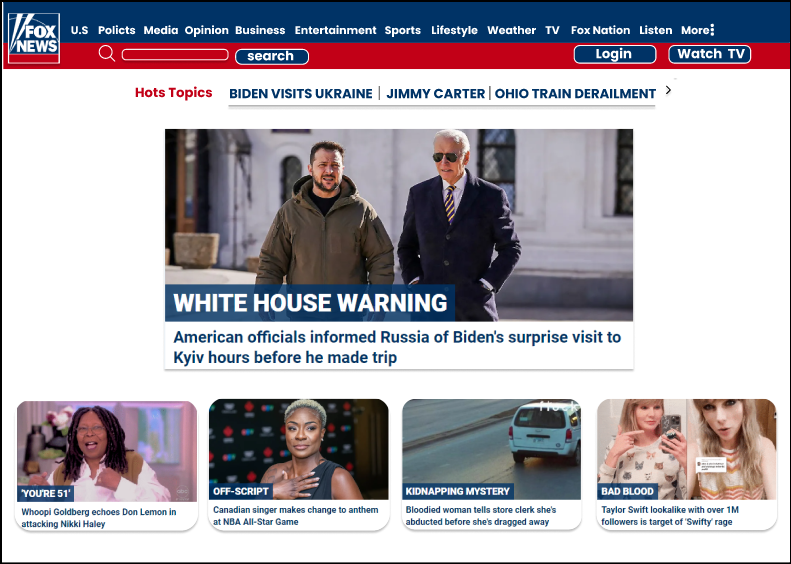

# Atividade_"4. Interfaces para que te quero..."

**Interfaces**
* 2007_ https://web.archive.org/web/20071201033920/http://www.foxnews.com 

* 2012_ https://web.archive.org/web/20121201022138/http://www.foxnews.com/

* 2017_ https://web.archive.org/web/20171201000001/http://www.foxnews.com/

* 2022_ https://web.archive.org/web/20221130234713/https://www.foxnews.com/
  ****************************************************************

* Qual era o o propósito inicial do site? 
  
  Canal de comunicação.
  
* O site propósito mudou ao longo do tempo? 

  
     Sim, as interfaces dos sites 2007 e 2012, tiveram mudanças de desing mais nítidas. Já as interfaces dos sites 2017 e 2022, as mudanças no desing foi minímas.

* Quais os problemas que esse site tinha quando "novo" e quais têm agora? 

     Os problemas do site 2007: o layout não ocupava 100% da tela, o estilo da fonte e muita informação em cima da outra. Os problemas do site 2022: o desing do layout, mesmo tendo melhorado, não chamaria minha atenção para querer ler.
  
* Que melhorias você faria nesse site para que ele pudesse ser mais interessante para um público jovem, de periferia, que não está acostumado ao uso de Internet por computadores e não tem interesses por notícias.

      Solucionando a questão levantada sobre as possíveis melhorias realizadas no site para melhorar a experiência de usuários com vivência nas comunidades, é plausível o desing da interface por ter muita poluição visual de notícias, e deixaria mais nítido os meios de navegação para o usuário, por exemplo: o input de navegação "search".
    
* Por último, crie um protótipo do figma (ou outra ferramenta de prototipagem) - ou mesmo um rascunho feito a mão - com aquilo que você acha que pode ser melhor executado nesta página hoje em dia.

    https://www.figma.com/file/c5V7wExkTkl77BgRCMFD7H/Fox_News?node-id=0%3A1&t=fcxt08mx8PWbyLEv-1

    